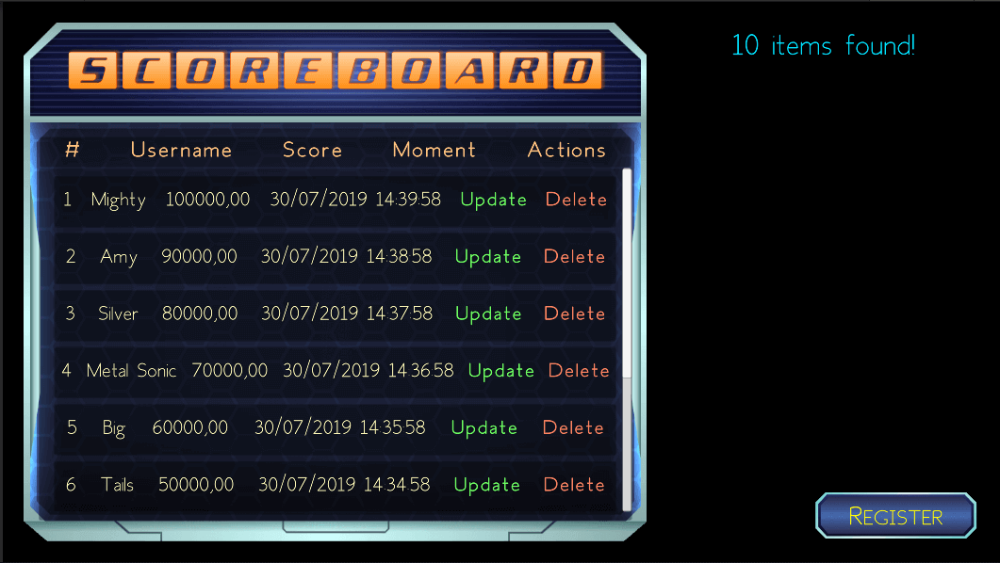
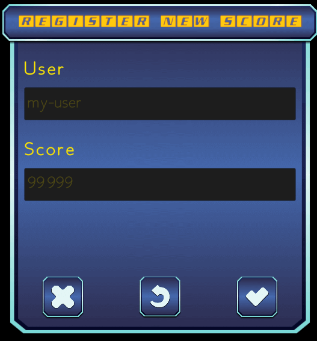

# Unity With Database

## About

Sample CRUD project of using Unity with MySQL.

## Screenshots

## Built with

* Unity
* C#
* Adobe Photoshop CS6
* MySQL
* XAMPP

## Running the project locally

* Download [XAMPP](https://www.apachefriends.org/pt_br/index.html) or [MySQL Community](https://www.mysql.com/downloads/).
* Make sure you have installed `MySQL` and run the content placed in [commands.sql file](Files/commands.sql).
* Download `.zip` file or `git clone` this repo.
* Make sure that you have version `2020.3.1f1` of Unity or more recent one.
* Open `Unity Hub` and import the project.
* Open the `Table` scene, and hit the play button.
* If everything is ok, it's supposed to show the content of `scoreboard` table in the Scoreboard ScrollView.

## Credits

* ["Fh Space" by Fictionalhead Design](https://www.dafont.com/pt/fh-space.font)
* ["New Space" by Woodcutter](https://www.dafont.com/pt/new-space.font)
* ["Space Shooter Game User Interface" by CraftPix.net Game Assets](https://opengameart.org/content/space-shooter-game-user-interface)